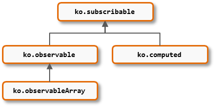

Às vezes, você pode encontrar oportunidades para simplificar o seu código, adicionando novas funcionalidades para o tipos de valores do core do Knockout. Você pode definir funções personalizadas em qualquer um dos seguintes tipos:

Por causa da herença, se você adicionar uma função para `ko.subscribable`, ele estará disponível em todos os outros também. Se você adicionar uma função para `ko.observable`, ele será herdada por `ko.observableArray`, mas não por `ko.computed`.

Para anexar uma função customizada, adicione isso em um dos seguintes pontos de extensibilidade:

 * `ko.subscribable.fn`
 * `ko.observable.fn`
 * `ko.observableArray.fn`
 * `ko.computed.fn`

Então sua função customizada ficará disponível em todos os tipos de valores criados a partir desse momento.

***Nota:*** É melhor usar esse ponto de extensibilidade apenas para funções personalizadas que são verdadeiramente aplicáveis em uma ampla gama de cenários. Você não precisa uma função personalizada para esses namespaces se você está apenas planejando usá-lo uma vez. 

### Exemplo: Uma view filtrada de um observable array

Aqui está uma maneira de definir uma função `filterByProperty` que estará disponível em todas as instâncias `ko.observableArray` posteriormente criadas:

    ko.observableArray.fn.filterByProperty = function(propName, matchValue) {
        return ko.pureComputed(function() {
            var allItems = this(), matchingItems = [];
            for (var i = 0; i < allItems.length; i++) {
                var current = allItems[i];
                if (ko.unwrap(current[propName]) === matchValue)
                    matchingItems.push(current);
            }
            return matchingItems;
        }, this);
    }

Isso retorna um novo valor computed que fornece uma view filtrada de um array, deixando o array original inalterado. Como o array filtrado é um computed observable, ele será reavaliado sempre que o array for alterado.

O seguinte exemplo mostra como você pode utilizar isso:


<h3>All tasks ( )</h3>
<ul data-bind="foreach: tasks">
    <li>
        <label>
            <input type="checkbox" data-bind="checked: done" />
             
        </label>
    </li>
</ul>

<h3>Done tasks ( )</h3>
<ul data-bind="foreach: doneTasks">
    <li data-bind="text: title"></li>
</ul>



function Task(title, done) {
    this.title = ko.observable(title);
    this.done = ko.observable(done);
}

function AppViewModel() {
    this.tasks = ko.observableArray([
        new Task('Find new desktop background', true),
        new Task('Put shiny stickers on laptop', false),
        new Task('Request more reggae music in the office', true)
    ]);

    // Here's where we use the custom function
    this.doneTasks = this.tasks.filterByProperty("done", true);
}

ko.applyBindings(new AppViewModel());




#### Isso não é obrigatório

Se você tende a filtrar muitos arrays observable, adicionar um `filterByProperty` globalmente para todos os arrays observable pode deixar o seu código mais limpo. Mas se você precisa filtrar ocasionalmente, você poderia escolher *não* adicionar `ko.observableArray.fn`, ao invés de apenas construir doneTasks na mão como o seguinte:

    this.doneTasks = ko.pureComputed(function() {
        var all = this.tasks(), done = [];
        for (var i = 0; i < all.length; i++)
            if (all[i].done())
                done.push(all[i]);
        return done;
    }, this);